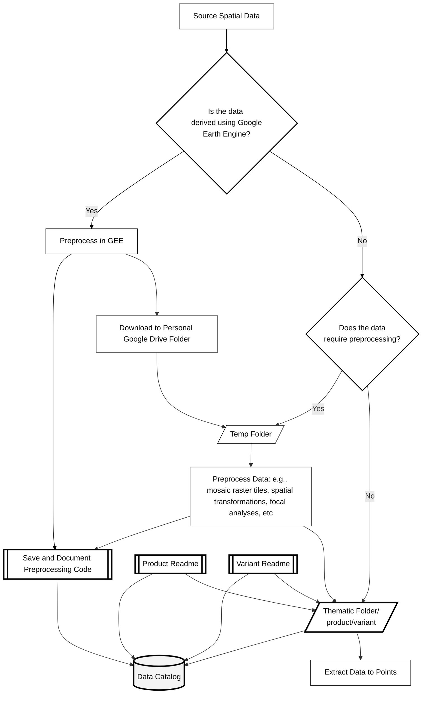

<!--

-->


# Geospatial Data Catalog and Management Guide


Here, we provide of catalog of all of geospatial data gathered and managed by the Science Centre, and R package/vignette for querying the catalog, links to external catalogs, and guide for the internal management of geospatial data.

The catalog documents all spatial data that has been pre-processed for the ABMI Science Centre. 

The catalog includes:
- Metadata for each dataset.
- Relative paths to the data stored on the Science Centre's internal server.
- Links to associated preprocessing scripts.

In addition, a working list of predictor variables [here](https://github.com/bgcasey/spatial_data_catalog/blob/main/predictor_variable_list.csv).

This is a sibling repository to the Science Centre's [Geospatial Preprocessing and Extraction Toolkit](https://github.com/bgcasey/geospatial_preprocessing_and_extraction_toolkit).
The toolkit contains genalized preprossing scripts, Google Earth Engine functions, and a vignette for summarizing spatial data to points and polygons using R.

</br>

## Table of Contents
- [1. Data Catalogs](#1-data-catalogs)
- [2. Scripts for Extracting and Processing Spatial Data](#2-scripts-for-extracting-and-processing-spatial-data)
- [3. Data Storage](#3-data-storage)
- [4. Metadata Standards](#4-metadata-standards)
- [5. Spatial Data Storage and Extraction Workflow](#5-spatial-data-storage-and-extraction-workflow)

---

## 1. Data Catalogs

### Internal Catalog
- [Predictor Variable List](predictor_variable_list.csv)
- Spatial data stored on the Science Centre's server.

### External Catalogs

- [Alberta Government Open Data](https://open.alberta.ca/opendata)
- [AltaLIS Open Data](https://www.altalis.com/)
- [Arctic-Boreal Vulnerability Experiment (ABoVE) Products](https://daac.ornl.gov/cgi-bin/dataset_lister.pl?p=34)
- [Awesome GEE Community Catalog](https://developers.google.com/earth-engine/datasets)
- [Google Earth Engine Data Catalog](https://developers.google.com/earth-engine/datasets)
- [National Terrestrial Ecosystem Monitoring System for Canada (NTEMS)](https://opendata.nfis.org/mapserver/nfis-change_eng.html)

**Spectral Indices**

- [Awesome Spectral Indices](https://github.com/awesome-spectral-indices/awesome-spectral-indices?tab=readme-ov-file)

---

## 2. Scripts for Extracting and Processing Spatial Data

- [Google Earth Engine Functions](https://github.com/bgcasey/google_earth_engine_functions)
- R
- ArcGIS Python

---

## 3. Data Storage

Once downloaded, data should be stored in a spatial data directory in folders organized by data thematic type. The script [create_spatial_data_dir.py](scripts/create_spatial_data_dir.py) can be used to create an empty directory. Each spatial dataset should be stored in a subfolder stored within the corresponding thematic folder. Thematic folders are based on [ISO 19115 Topic Categories](https://nap.geogratis.gc.ca/metadata/register/registerItems-eng.html#RI_653). 

**Table 1.** Thematic directories for organizing geospatial data, directory descriptions, and examples of corresponding geospatial data.

| **Folder (ISO Topic Category Name)** | **Description**                                                                  | **Examples**                                                                                                                                                                       |
| ------------------------------------ | -------------------------------------------------------------------------------- | ---------------------------------------------------------------------------------------------------------------------------------------------------------------------------------- |
| **farming**                          | Rearing of animals and/or cultivation of plants.                                 | Agriculture, irrigation, aquaculture, plantations, herding, pests and diseases affecting crops and livestock.                                                                      |
| **biota**                            | Flora and/or fauna in natural environments.                                      | Wildlife, vegetation, biological sciences, ecology, wilderness areas, wetlands, habitat.                                                                                           |
| **boundaries**                       | Legal land descriptions.                                                         | Political and administrative boundaries.                                                                                                                                           |
| **climatologyMeteorologyAtmosphere** | Processes and phenomena of the atmosphere.                                       | Cloud cover, weather, climate, atmospheric conditions, climate change, precipitation.                                                                                              |
| **economy**                          | Economic activities, conditions, and employment.                                 | Production, labor, revenue, commerce, industry, tourism, forestry, fisheries, commercial or subsistence hunting.                                                                   |
| **elevation**                        | Height above or below sea level.                                                 | Altitude, bathymetry, digital elevation models, slope, derived products.                                                                                                           |
| **environment**                      | Environmental resources, protection, and conservation.                           | Environmental pollution, waste storage and treatment, environmental impact assessment, monitoring environmental risk, nature reserves.                                             |
| **geoscientificInformation**         | Information pertaining to earth sciences.                                        | Geology, minerals, geophysical features and processes, hydrology, glacial geology, erosion, geomorphology, sedimentation.                                                          |
| **health**                           | Health, health services, human ecology, and safety.                              | Disease, illness, public health, health services.                                                                                                                                  |
| **imageryBaseMapsEarthCover**        | Base maps.                                                                       | Land cover, topographic maps, imagery.                                                                                                                                |
| **intelligenceMilitary**             | Military bases, structures, activities.                                          | Barracks, training grounds, military transportation, information collection.                                                                                                       |
| **inlandWaters**                     | Inland water features, drainage systems, and their characteristics.              | Rivers and glaciers, salt lakes, water utilization plans, dams, currents, floods, water quality, hydrographic charts.                                                              |
| **location**                         | Positional information and services.                                             | Addresses, geodetic networks, control points, postal zones, place names.                                                                                                           |
| **oceans**                           | Features and characteristics of salt water bodies (excluding inland waters).     | Tides, tidal waves, coastal information, reefs.                                                                                                                                    |
| **planningCadastre**                 | Information used for appropriate actions for future use of the land.             | Land use maps, zoning maps, cadastral surveys, land ownership.                                                                                                                     |
| **society**                          | Characteristics of society and culture.                                          | Settlements, anthropology, archaeology, education, traditional beliefs, manners and customs, demographic data, recreational areas and activities.                                  |
| **structure**                        | Man-made construction.                                                           | Buildings, museums, churches, factories, housing, monuments, shops, towers.                                                                                                        |
| **transportation**                   | Means and aids for conveying persons and/or goods.                               | Roads, airports, airstrips, shipping routes, tunnels, nautical charts, vehicle and vessel locations, aeronautical charts, railways, trails.                                        |
| **utilitiesCommunication**           | Energy, water and waste systems, and communications infrastructure and services. | Hydro-electricity, geothermal, solar and nuclear sources of energy, water purification, sewage treatment, electricity and gas distribution, data communication, telecommunication. |

### Products and variants

Within a thematic folder, each **product** gets one folder. A product
is the thing the provider published: ClimateNA, ABMI Human Footprint,
NTEMS land cover. Inside it, each **variant** gets its own subfolder. A
variant is that same product at one resolution, CRS, and grid
alignment.

```
climatologyMeteorologyAtmosphere/
└── climate_na/                                 # product
    ├── readme.txt                              # ← product record
    ├── native/                                 # variant
    │   ├── readme.txt                          # ← variant record
    │   └── climatena_mat_1961-1990_native.tif
    └── abmi1km/                                # variant
        ├── readme.txt                          # ← variant record
        └── climatena_mat_1961-1990_abmi1km.tif
```

Rules:

- **One folder per variant.** Never mix resolutions or grids in one
  folder. If the resolution, CRS, or grid origin differs, it is a
  different variant.
- **`native`** holds the data as delivered by the provider, converted
  in format only. It is the reference against which every derived
  variant can be checked.
- **Variant folder names are short and describe the grid**, not the
  processing: `native`, `abmi1km`, `abmi250m`. The full variant
  identifier is `{product_id}__{variant}`, e.g. `climate_na__abmi1km`.
- **Data filenames carry the variant suffix** so a file remains
  identifiable once it is copied out of the directory:
  `{product_id}_{measure}_{period}_{variant}.tif`.
- **Every folder at both levels holds a `readme.txt`.** A variant
  folder without one is undocumented data.

---

## 4. Metadata Standards

Metadata is recorded in plain-text `readme.txt` files that comply with
the **[North American Profile (NAP) of the ISO 19115: Geographic
Information – Metadata
Standard](https://www.fgdc.gov/standards/projects/incits-l1-standards-projects/NAP-Metadata)**.

Metadata is split across two levels, matching the product/variant
directory structure described in
[Section 3](#3-data-storage). Each fact is recorded once, at the level
where it is actually true.

| Record | Template | Describes |
| --- | --- | --- |
| **Product readme** — `{product}/readme.txt` | [product_metadata_template.txt](product_metadata_template.txt) | The data as published by the provider: what it is, who made it, when it covers, how it may be used, how to cite it. |
| **Variant readme** — `{product}/{variant}/readme.txt` | [variant_metadata_template.txt](variant_metadata_template.txt) | The geometry and provenance of one processed copy: resolution, CRS, extent, grid alignment, derivation, format. |

The two records read together as the full description of a file. A
variant readme does not repeat the product's title, abstract, licence,
contacts, or citation; it points at the parent record instead.

**Table 2.** Which record holds which metadata block.

| Block | Product | Variant |
| --- | :---: | :---: |
| Title, Abstract, Purpose, Credits, Language, Topic Category, Keywords | ✓ | — |
| Layers and bands (measure, units, scale, valid range, class definitions) | ✓ | — |
| Variant list | ✓ | — |
| Temporal information (publication date, extent, resolution, version) | ✓ | — |
| Lineage — the provider's processing | ✓ | — |
| Positional accuracy — as stated by the provider | ✓ | — |
| Use and access constraints | ✓ | — |
| Online resource (provider URL) | ✓ | — |
| Contact and internal steward | ✓ | — |
| Citation, DOI | ✓ | — |
| Spatial resolution | — | ✓ |
| Geographic information (CRS, extent, native extent) | — | ✓ |
| Reference grid alignment | — | ✓ |
| Derivation (input, operation, method, script, commit, version) | — | ✓ |
| Lineage — this processing step | — | ✓ |
| Positional accuracy — of this variant | — | ✓ |
| Known caveats | — | ✓ |
| Format, data type, size | — | ✓ |

Two rules keep the split honest:

1. **Never copy a field down.** If the provider states ±10 m horizontal
   accuracy, that belongs in the product record. Do not restate it in a
   variant record; aggregating to 1 km invalidates it.
2. **Never state geometry up.** The provider's published resolution can
   be described as prose in the product abstract, but the measured
   resolution, CRS, and extent of a file belong only to the variant
   that holds that file.

---

## 5. Spatial Data Storage and Extraction Workflow

The workflow begins with sourceing biologically relevent spatial data determining if it needs to be manaully derived using Google Earth Engine (GEE). If yes, preprocessing is done using GEE. Once preprocessed the spatial data is exported to a personal Google Drive folder, and subsequently stored in a temporary folder for further preprocessing. Non-GEE data is assessed to check if preprocessing is required. If preprocessing is necessary, the data is also stored in the temporary folder and processed. Once ready, preprocessed data is stored in a variant folder inside the product folder, within the thematic folder corresponding to its topic category (e.g. biota, elevation, or inlandWaters). The product folder holds a readme describing the source data; each variant folder holds a readme describing the geometry and processing of the files beside it. Finally, the processed data is extracted to specific points for further analysis. 




**Figure 1.** Conceptual diagram of the Science Centre's geospatial data managemet workflow, including sourcing, preprocessing, storage, and extraction.
